# Antigravity Browser Agent Troubleshooting Guide

**Document Version:** 1.0  
**Last Updated:** 2026-01-10  
**Issue Type:** Browser Agent Unavailable / Unable to Open

---

## Table of Contents

1. [Overview](#overview)
2. [Common Symptoms](#common-symptoms)
3. [Root Causes](#root-causes)
4. [Diagnostic Log Analysis](#diagnostic-log-analysis)
5. [Solution Steps](#solution-steps)
6. [Verification](#verification)
7. [Prevention](#prevention)
8. [Additional Resources](#additional-resources)

---

## Overview

The **Antigravity Browser Agent Unavailable** error occurs when the Google Antigravity IDE loses connection to the Antigravity Browser Control extension, preventing the AI agent from autonomously viewing and testing websites. This document provides a comprehensive troubleshooting workflow based on real-world resolution cases.

### Key Technologies Involved

- **Antigravity IDE**: Developer tool released in late 2025
- **Antigravity Browser Control Extension**: Chrome extension for AI agent control
- **Chrome DevTools Protocol (CDP)**: Port 9222 for remote debugging
- **Google Cloud CLI (gcloud)**: Authentication mechanism
- **Language Server**: Go-based backend service

---

## Common Symptoms

### 1. Browser Launch Failures

```
Error: Browser Agent Unavailable
Error: Not able to open browser
```

### 2. Port Conflicts

```log
Chrome with CDP is already running on port 9222
Browser startup timed out after 5000ms on port 9223
```

### 3. Authentication Issues

```log
Cache(userInfo): Singleflight refresh failed: You are not logged into Antigravity
```

### 4. Network Connection Aborts

```log
wsarecv: An established connection was aborted by the software in your host machine
```

---

## Root Causes

### 🔴 Critical Issues

| Issue | Description | Impact |
|-------|-------------|--------|
| **Port 9222 Conflict** | Zombie Chrome process holding debugging port | Browser cannot launch |
| **Missing gcloud CLI** | Google Cloud CLI not installed or not in PATH | Authentication failure |
| **Firewall/Antivirus Block** | Windows Defender blocking Language Server | Connection aborts |
| **Extension Not Installed** | Browser Control extension missing from managed profile | Agent has no browser access |

### 🟡 Secondary Issues

- **WSL2/Docker Container Isolation**: Network isolation prevents Chrome launch
- **Corrupt Browser Profile**: Damaged `.gemini/antigravity-browser-profile` directory
- **WebView Process Stuck**: Background bridge process frozen

---

## Diagnostic Log Analysis

### Timeline: Browser Launch Issue

```log
21:00:32 [✓] Language Server Started
         Language server initialized successfully on port 32881

21:00:36 [✓] LS Client Connected  
         LS lspClient started successfully

21:04:13 [🔄] Browser Launch Attempted
         No Chrome with CDP found on port 9222. Safe to launch Chrome.

21:04:14 [❌] Port Conflict Detected
         Chrome with CDP is already running on port 9222

21:04:14 [✓] Browser Ready (After Fix)
         Browser ready on port 9222 after 1938ms
```

### Critical Log Indicators

#### ❌ **FAILURE PATTERNS**

```log
# Authentication Failure
W0110 21:00:33 Cache(userInfo): Singleflight refresh failed: You are not logged into Antigravity

# Network Abort (Firewall)
wsarecv: An established connection was aborted by the software in your host machine

# Port Conflict
Chrome with CDP is already running on port 9222

# Command Not Found
CommandNotFoundException: gcloud
```

#### ✅ **SUCCESS PATTERNS**

```log
# Successful Browser Launch
No Chrome with CDP found on port 9222. Safe to launch Chrome
Browser ready on port 9222 after 1938ms

# Stable Language Server
LS lspClient started successfully
```

---

## Solution Steps

### 🛠️ Step 1: Kill Zombie Chrome Processes

**Windows PowerShell (Administrator):**

```powershell
# Find process using port 9222
netstat -ano | findstr :9222

# Kill the process (replace <PID> with actual PID from above)
taskkill /PID <PID> /F

# Alternative: Kill all Chrome processes
Get-Process chrome -ErrorAction SilentlyContinue | Stop-Process -Force
```

**Task Manager Method:**

1. Press `Ctrl + Shift + Esc`
2. Go to **Details** tab
3. Find and end all `chrome.exe` processes
4. Also terminate any `WebView` or `antigravity` processes

---

### 🛠️ Step 2: Install and Configure Google Cloud CLI

#### Check Current Status

```powershell
gcloud --version
```

If you see `CommandNotFoundException`, proceed with installation.

#### Installation (Windows)

**Method 1: PowerShell Installer (Recommended)**

```powershell
# Run as Administrator
(New-Object Net.WebClient).DownloadFile(
  "https://dl.google.com/dl/cloudsdk/channels/rapid/GoogleCloudSDKInstaller.exe",
  "$env:Temp\GoogleCloudSDKInstaller.exe"
)
& $env:Temp\GoogleCloudSDKInstaller.exe
```

> [!IMPORTANT]
> **CRITICAL**: During installation, check the box **"Add Google Cloud CLI executables to my PATH"**

#### Manual PATH Configuration

If the installer fails to set PATH automatically:

1. **Locate gcloud directory** (one of these):
   ```
   C:\Program Files\Google\Cloud SDK\google-cloud-sdk\bin
   C:\Users\<USERNAME>\AppData\Local\Google\Cloud SDK\google-cloud-sdk\bin
   ```

2. **Add to System PATH**:
   - Press `Windows Key` → type `env` → **Edit the system environment variables**
   - Click **Environment Variables**
   - Under **System variables**, select `Path` → **Edit**
   - Click **New** → Paste the `\bin` path from step 1
   - Click **OK** on all windows

3. **CRITICAL**: **Restart your computer** for PATH changes to take effect

#### Authenticate

```powershell
gcloud auth login --update-adc
```

Follow the browser login flow that opens.

---

### 🛠️ Step 3: Configure Firewall Exclusions

The `wsarecv` error indicates Windows Firewall is blocking the Language Server.

#### Windows Defender Exclusions

1. Open **Windows Security**
2. **Virus & threat protection** → **Manage settings**
3. Scroll to **Exclusions** → **Add or remove exclusions**
4. Click **Add an exclusion** → **Folder**
5. Add these folders:
   ```
   C:\Users\<USERNAME>\.gemini
   C:\Users\<USERNAME>\.antigravity
   C:\Program Files\Google\Cloud SDK
   ```

#### Firewall Allow Rules (If Issues Persist)

```powershell
# Run as Administrator
New-NetFirewallRule -DisplayName "Antigravity Language Server" `
  -Direction Inbound -Protocol TCP -LocalPort 9222,9223 -Action Allow

New-NetFirewallRule -DisplayName "Antigravity Language Server" `
  -Direction Outbound -Protocol TCP -LocalPort 9222,9223 -Action Allow
```

---

### 🛠️ Step 4: Install Chrome Extension

> [!NOTE]
> Antigravity uses a **managed Chrome profile**, NOT your default Chrome installation.

1. When the agent attempts to launch the browser, watch for a popup:
   > **"Install Extension"** → Click **Install**

2. **OR** manually trigger:
   - Click the **Chrome icon** in the IDE's top-right corner
   - This forces the extension installation prompt

3. Verify installation:
   - Open the managed Chrome window (launched by Antigravity)
   - Navigate to `chrome://extensions`
   - Confirm **"Antigravity Browser Control"** is enabled

---

### 🛠️ Step 5: Clean Browser Profile (Nuclear Option)

If errors persist after all above steps:

> [!CAUTION]
> This will delete all browsing data in the Antigravity managed profile (not your main Chrome).

```powershell
# Close Antigravity IDE completely first
Remove-Item -Recurse -Force "$env:USERPROFILE\.gemini\antigravity-browser-profile"
```

The next browser launch will create a fresh profile.

---

### 🛠️ Step 6: WSL2 / Docker Container Users

> [!WARNING]
> **Known Limitation**: Antigravity running inside WSL2 or Docker containers often cannot access the host's Chrome browser due to network isolation.

#### Solutions

**Option A: Port Forwarding (WSL2)**

```bash
# Inside WSL2
export DISPLAY=:0

# Forward Chrome DevTools Protocol port
netsh.exe interface portproxy add v4tov4 listenport=9222 listenaddress=0.0.0.0 connectport=9222 connectaddress=127.0.0.1
```

**Option B: Install Natively (Recommended)**

Install Antigravity IDE directly on Windows/Mac host OS instead of inside container.

---

## Verification

### ✅ Success Indicators

After applying fixes, you should see:

```log
✓ gcloud --version returns version info
✓ Browser ready on port 9222 after [time]ms
✓ LS lspClient started successfully
✓ No wsarecv errors in logs
```

### Test Browser Agent

In Antigravity IDE chat:

```
Test google.com
```

**Expected Result**: Agent navigates the managed Chrome window to Google without opening a new window.

---

## Prevention

### Best Practices

1. **Always close Antigravity IDE cleanly** to prevent zombie Chrome processes
2. **Check gcloud authentication monthly**:
   ```powershell
   gcloud auth list
   gcloud auth login --update-adc  # If expired
   ```
3. **Keep firewall exclusions updated** after Windows updates
4. **Monitor port 9222**:
   ```powershell
   netstat -ano | findstr :9222
   # Should return nothing when IDE is closed
   ```

### Automation: Startup Script

Create `antigravity-startup.ps1`:

```powershell
# Kill potential zombie processes
Get-Process chrome -ErrorAction SilentlyContinue | Where-Object {
  $_.CommandLine -like "*remote-debugging-port=9222*"
} | Stop-Process -Force

# Verify gcloud
if (-not (Get-Command gcloud -ErrorAction SilentlyContinue)) {
  Write-Error "gcloud CLI not found in PATH!"
  exit 1
}

# Check authentication
$authStatus = gcloud auth list --filter=status:ACTIVE --format="value(account)"
if (-not $authStatus) {
  Write-Host "Refreshing authentication..."
  gcloud auth login --update-adc
}

Write-Host "✓ Ready to launch Antigravity IDE"
```

Run this before opening the IDE.

---

## Additional Resources

### Official Documentation

- [Antigravity Browser Documentation](https://antigravity.google.com/docs/browser)
- [Chrome Extension Guide](https://antigravity.google.com/docs/chrome-extension)
- [Google Cloud CLI Installation](https://cloud.google.com/sdk/docs/install)

### Common Error Codes

| Error | Meaning | Solution |
|-------|---------|----------|
| `CommandNotFoundException: gcloud` | gcloud not in PATH | Install/configure PATH |
| `wsarecv` | Firewall blocking connection | Add firewall exclusions |
| `Chrome with CDP is already running` | Port 9222 occupied | Kill zombie Chrome |
| `You are not logged into Antigravity` | Authentication expired | Run `gcloud auth login` |
| `Browser startup timed out` | Firewall or zombie process | Steps 1 + 3 |

### Community Support

- [Antigravity Issues (Reddit)](https://reddit.com/r/antigravity)
- [Stack Overflow - antigravity tag](https://stackoverflow.com/questions/tagged/antigravity)
- [GitHub Discussions](https://github.com/google/antigravity/discussions)

---

## Troubleshooting Workflow Diagram

```mermaid
flowchart TD
    Start([Browser Agent Error]) --> CheckLogs{Check IDE Logs}
    
    CheckLogs -->|Port 9222 conflict| KillChrome[Step 1: Kill Zombie Chrome]
    CheckLogs -->|gcloud not found| InstallGcloud[Step 2: Install gcloud CLI]
    CheckLogs -->|wsarecv error| Firewall[Step 3: Configure Firewall]
    CheckLogs -->|Extension missing| Extension[Step 4: Install Extension]
    
    KillChrome --> Verify{Test Browser Launch}
    InstallGcloud --> Auth[Authenticate with gcloud]
    Auth --> Verify
    Firewall --> Verify
    Extension --> Verify
    
    Verify -->|Still failing| Nuclear[Step 5: Clean Browser Profile]
    Verify -->|Success| Success([✓ Browser Agent Working])
    
    Nuclear --> Verify
    
    style Start fill:#f44336,color:#fff
    style Success fill:#4caf50,color:#fff
    style Nuclear fill:#ff9800,color:#fff
```



---

## Case Study: Real-World Resolution

### Initial State (19:39:59)

```
❌ Browser Agent Unavailable
❌ Chrome with CDP is already running on port 9222
❌ wsarecv: connection aborted by software
❌ gcloud: CommandNotFoundException
```

### Actions Taken

1. ✅ Killed zombie Chrome process (port 9222)
2. ✅ Installed Google Cloud CLI with PATH configuration
3. ✅ Added firewall exclusions for `.gemini` folder
4. ✅ Restarted system for PATH changes
5. ✅ Authenticated via `gcloud auth login --update-adc`

### Final State (21:04:14)

```
✅ Browser ready on port 9222 after 1938ms
✅ LS lspClient started successfully
✅ No wsarecv errors
✅ Agent successfully navigated to google.com
```

**Total Resolution Time**: ~1.5 hours (including system restart)

---

## Appendix: Log Analysis Commands

### Extract Antigravity Logs (Windows)

```powershell
# Find log files
Get-ChildItem -Recurse -Filter "*antigravity*.log" `
  -Path "$env:USERPROFILE\.gemini", "$env:LOCALAPPDATA\Antigravity" `
  -ErrorAction SilentlyContinue

# View recent errors
Select-String -Path "C:\Users\<USERNAME>\.gemini\logs\*.log" `
  -Pattern "error|fail|wsarecv|9222" -CaseSensitive:$false |
  Select-Object -Last 20
```

### Check Port Usage

```powershell
# Detailed port 9222 status
Get-NetTCPConnection -LocalPort 9222 -ErrorAction SilentlyContinue |
  Format-Table State, OwningProcess, @{
    Name="ProcessName"
    Expression={(Get-Process -Id $_.OwningProcess).ProcessName}
  }
```

---

## Version History

| Version | Date | Changes |
|---------|------|---------|
| 1.0 | 2026-01-10 | Initial documentation based on production incident |

---

## Contributing

Found a new solution or edge case? Please contribute to this document:

1. Test the solution in your environment
2. Document the symptoms, cause, and fix
3. Add log examples where applicable
4. Submit updates via your team's documentation workflow

---

**Document maintained by**: DevOps & Infrastructure Team  
**Last verified**: 2026-01-10  
**Status**: ✅ Active & Tested
